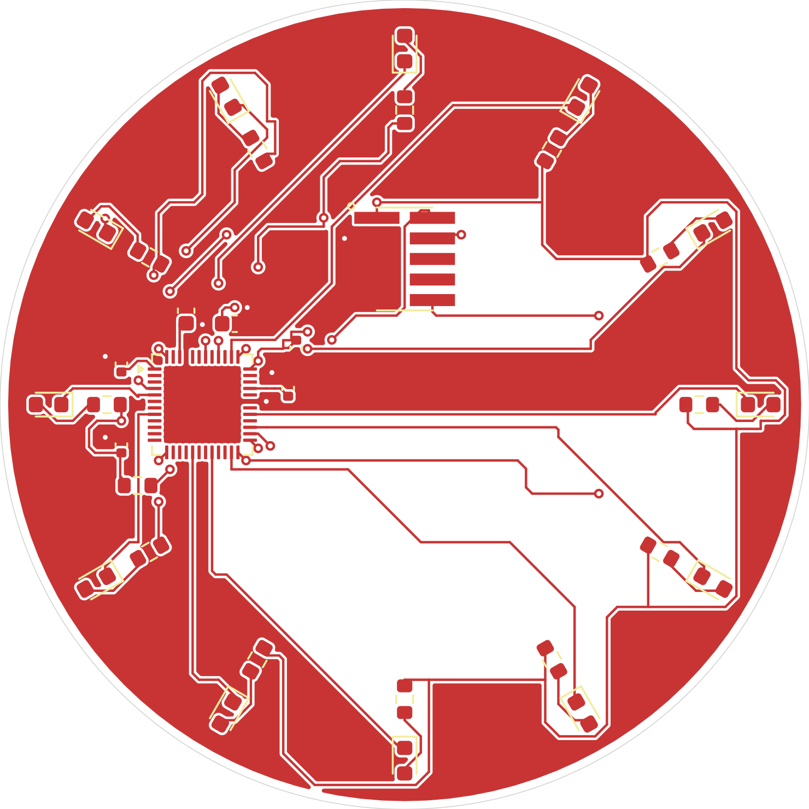
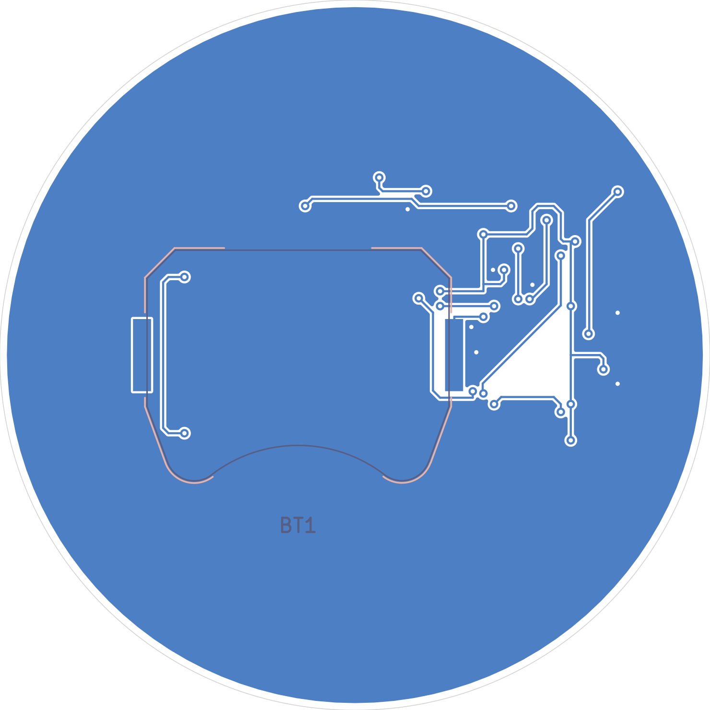
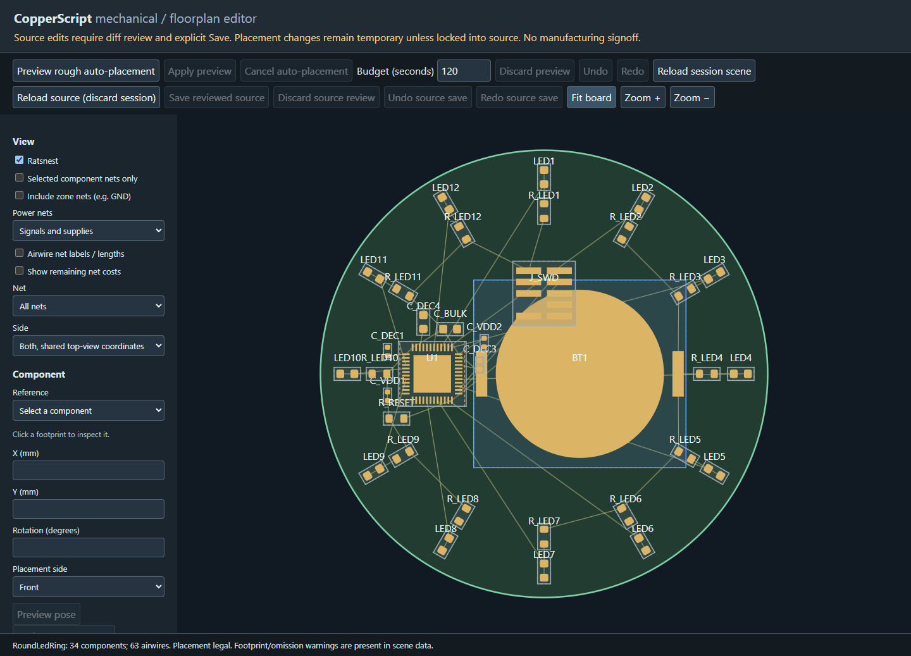

# CopperLedRing

[](https://github.com/andenore/CopperLedRing/actions/workflows/build.yml)

**A minimal [CopperScript](https://github.com/andenore/CopperScript) example
project and reusable board-project template.** It is also intended to be a
direct-order hardware proof of concept: take a release's manufacturing
and assembly files, order the board, and try the design without writing your own
circuit first.

**Manufacturing target: assembled, unprogrammed hardware.** `make order` builds
the complete routed board, checks native KiCad DRC, validates all 34 exact BOM
selections and generates manufacturing/assembly files. Independent CAM
qualification is explicitly skipped; firmware is outside scope. Before submitting
an order, check supplier availability, BOM matching and the assembled preview.
Generated files are not a stock reservation, factory approval or a tested unit.

## The board

A 50 mm circular, two-layer board with an nRF52832 QFAA controlling twelve
active-low red LEDs, a rear Keystone 3034 CR2032 holder, a 10-pin SMD Cortex-M
SWD header, and bypass/LDO-support capacitors. This is an LED controller:
**Bluetooth is not fitted**, and there is no antenna or external crystal.

### Routed board — native DRC clean

These are renders of the actual locked-build KiCad board, not a mockup
or a photograph of assembled hardware. The front has twelve LEDs around the
edge, their resistors just inside, the MCU to the left of centre and the SWD
connector above it. Both sides have GND pours with disconnected islands removed.
The mirrored rear view shows the battery holder and rear routes.
Fabrication labels are omitted on the front for readability.

| Front: routed copper, GND fill and silkscreen | Rear: mirrored routes, holder outline and GND fill |
| --- | --- |
|  |  |

**Verified routing status (2026-10-04, KiCad 10.0.6): 393 track segments,
36 vias, 0 DRC violations, 0 isolated islands and 0 unconnected items.** All 31
ordinary nets route; GND connectivity is independently verified after native
copper refill. The updated exact-part board passed the locked-dependency routing
and manufacturing build both locally and in
[GitHub run 37186364137](https://github.com/andenore/CopperLedRing/actions/runs/37186364137)
(source/build revision `b8e60a3`). Its uploaded package was checked for zero native
violations/opens, all 34 BOM/CPL references, the rear holder and valid checksums.
The images are from that verified routed result. No hand-routed tracks,
clearance waivers or via-in-pad permissions are used.

`build/route.json` reports `routing_complete=true` and
`native_fill_verified=true`, but **`fabrication_ready=false`**. Intent-only GND
zones remain deferred in the explicit-copper graph; only the native filled-board
check closes them. Routing completion is not assembly or manufacturing signoff.

The source snapshot's SHA-256 is
`c2820b7bb9bbd576815a3ab3f9bbe948c3cd2f861266afea02920870946c487d`
(`board.copper`). Checked-in images are snapshots; regenerate them when the
source/placement changes. The source build, not these images, remains authoritative.

`board.copper` is the authoritative circuit and mechanical intent, including
the circular outline, fixed positions/rotations, front/rear ground pours and
0.15 mm minimum track/clearance rules. There is no Python placement builder,
compiler source, test suite, or manually checked-out component library here.

## Build from a fresh checkout

Install Git, [uv](https://docs.astral.sh/uv/), GNU Make and KiCad 10
with its standard footprint libraries. The inspected baseline uses KiCad 10.0.6.
The Python/compiler and CopperLib Git revisions are pinned by the committed
`uv.lock`, `copper.mod` and `copper.lock`.

```sh
git clone https://github.com/andenore/CopperLedRing.git
cd CopperLedRing
make pcb render             # quick placed/unrouted inspection build
make                        # route, refill, native DRC, BOM/CPL, manufacturing files and renders
make order                  # same build, plus a reminder of the upload files
```

The first build automatically downloads CopperScript and CopperLib from their
pinned GitHub revisions. **Neither repository needs to be checked out manually.**
Later CopperLib operations are locked/offline; footprint geometry comes from
the installed KiCad libraries. No local dependency replacements are used.

Windows (PowerShell with GNU Make on PATH):

```powershell
make pcb render KICAD_CLI="C:/Program Files/KiCad/10.0/bin/kicad-cli.exe" FOOTPRINT_ROOT="C:/Program Files/KiCad/10.0/share/kicad/footprints"
make KICAD_CLI="C:/Program Files/KiCad/10.0/bin/kicad-cli.exe" FOOTPRINT_ROOT="C:/Program Files/KiCad/10.0/share/kicad/footprints"
```

Targets:

| Target | Purpose |
| --- | --- |
| `make check` | Install locked dependencies, fetch/verify CopperLib, run ERC |
| `make pcb` | Export a placed, unrouted KiCad inspection project |
| `make edit` | Open CopperScript's shared mechanical/floorplan editor with real footprints |
| `make route` | Run package escapes, detailed routing and native fill verification; profile every run |
| `make render` | Render front/back copper SVGs from the existing PCB |
| `make verify` | Refill/save copper and reject all native violations and opens |
| `make assembly` | Validate exact selections and export the JLCPCB BOM |
| `make manufacturing` | Route and verify, then export manufacturing files and both-side CPL |
| `make order` | Complete build and print supplier-upload reminders; does not place an order |

Generated KiCad files/local footprint tables, SVGs, routing/DRC reports and
`route.pstats` stay under ignored `build/`. Use `make render` to inspect a
draft left by a failed routing attempt. A nonzero exit is a failed check, not a
successful build. Do not use `make -i` to prepare an order. Routing can take
considerably longer than the inspection build.

For the README preview layer combinations, export from an existing inspection
build using KiCad (on Windows, use the executable path shown above):

```sh
kicad-cli pcb export svg --layers F.Cu,F.Silkscreen,Edge.Cuts --mode-single --fit-page-to-board --exclude-drawing-sheet --check-zones -o build/readme-front.svg build/board.kicad_pcb
kicad-cli pcb export svg --layers B.Cu,B.Fab,B.Silkscreen,Edge.Cuts --mirror --mode-single --fit-page-to-board --exclude-drawing-sheet --check-zones -o build/readme-back.svg build/board.kicad_pcb
```

The committed PNGs are rasterizations of those SVGs on a white background.

## Mechanical and placement editor

```sh
make edit
```

On Windows:

```powershell
make edit FOOTPRINT_ROOT="C:/Program Files/KiCad/10.0/share/kicad/footprints"
```

This uses the pinned compiler from GitHub, not a local CopperScript checkout or
project-specific editor script. The board's circular outline, LED positions and
rear battery holder come from `board.copper`. Scroll to zoom under the pointer;
right-drag to pan. Toggle Ratsnest to inspect connectivity. Rough auto-placement
is available as a preview, but deliberately fixed source poses stay fixed.
Enable explicit source-lock editing to review a change to a locked component.

Temporary placement is not saved. Persistent pose/geometry edits show an exact
source diff and require **Save reviewed source**; source Undo/Redo is separate
from temporary placement history. Imported library/profile content is read-only.
Edits invalidate previous routed/fill/manufacturing outputs: rerun `make` before
using them for an order. Editing does not confer production signoff. Ctrl+C stops
the local editor. `EDITOR_ARGS="--no-browser"` prints a URL without opening it.
The optional VS Code host uses the same editor core; see the
[CopperScript extension setup](https://github.com/andenore/CopperScript/tree/main/integrations/vscode).



Editor snapshot: unrouted intent, both sides in shared top-view coordinates (not
a copper-fill or manufacturing preview). Verified with the committed compiler
pin, 33 front/1 rear components and zero browser page errors; inspection made no
source changes. The routed images above remain from the documented build snapshot.

## Use this project as a template

Fork/copy the repository, change the module identity in `copper.mod`, then edit
`board.copper` to define your circuit, outline and constraints. Keep build and
verification logic in CopperScript/KiCad; the Makefile should remain simple.
Reusable part/device definitions belong in [CopperLib](https://github.com/andenore/CopperLib)
or another URL-imported library, not inside the compiler or a copied fixture.
Keep full commit pins and regenerate/review locks intentionally when upgrading.

## Order the proof of concept

Run `make order` from a fresh checkout. The authoritative output is
`build/manufacturing/`:

- `gerbers-drill.zip`: all copper, mask, silkscreen, paste and circular-outline
  Gerbers plus separate plated/nonplated metric drill files. Upload for fabrication.
- `bom.csv`: grouped JLCPCB selections for 34 components / nine exact MPNs.
- `cpl.csv`: placement coordinates/rotations for all 34 parts, including the rear
  battery holder. Upload BOM and CPL for assembly.
- `manufacturing-package.zip`: complete package, including the native PCB/project,
  local footprints, IPC-D-356 netlist, native positions, DRC report, manifest and
  checksums. Archive this with the source revision and ordering choices.

Native DRC and exact-selection checks are mandatory. Independent CAM qualification
is **not** required for this example; the manifest explicitly records it as skipped.
Repeat exports retain previous successful directories as ignored
`.manufacturing-previous-*` siblings. `make order` does not purchase or submit an order.
GNU Make is required; the same recipe runs in GitHub on Linux.

The [assembly review](ASSEMBLY.md) documents exact reusable CopperLib parts,
manufacturer polarity/footprint mappings and procurement codes. There are no
remaining placeholder LED/passive selections. Firmware is not a build gate.

Use two-layer, 50 mm circular FR-4 with the PCB's 1.6 mm thickness and populated
front/rear sides. Confirm copper weight, finish, solder mask, stencil/process
settings and double-sided assembly in the supplier's quotation. Check current
stock for the chosen quantity and inspect the upload preview: MCU/SWD pin 1,
LED cathodes and battery-holder polarity/side. No automatic supplier-specific
rotation corrections or substitutions are guessed. Supply the CR2032 separately.

Do not assume battery supply or firmware programming is included in PCBA.
This repository currently contains no firmware. The proof-of-concept user must
supply the CR2032 and program the MCU over SWD unless a qualified ordering guide
explicitly includes those services. The primary cell is **not rechargeable**:
SWD VREF is sense-only; never inject debugger power with the cell installed.
Firmware must keep the radio, NFC, HFXO and DC/DC disabled as appropriate and use
the internal clocks/LDO configuration. GPIO output LOW illuminates an LED.

## GitHub artifacts

Every push to `main`, pull request, manual run and `v*` tag runs the full `make`
workflow: routing, native KiCad DRC/connectivity checks, assembly selection checks,
manufacturing/assembly exports and layer rendering.
Routing is not an optional manual/tag-only step. Any routing failure, DRC
violation or open connection fails the job. Failed runs retain native diagnostics
and available layer previews as inspection artifacts, never as successful boards.
Successful runs upload a separate `CopperLedRing-manufacturing-<sha>` artifact;
failed builds publish diagnostics only. `v*` tags additionally publish all generated
manufacturing files as an experimental prerelease, clearly labelled as unprogrammed
hardware with independent CAM qualification skipped. Supplier preview/availability
review is still required before ordering. Do not tag an unverified build.

MIT license. Experimental hardware; verify supplier preview and availability before ordering.
